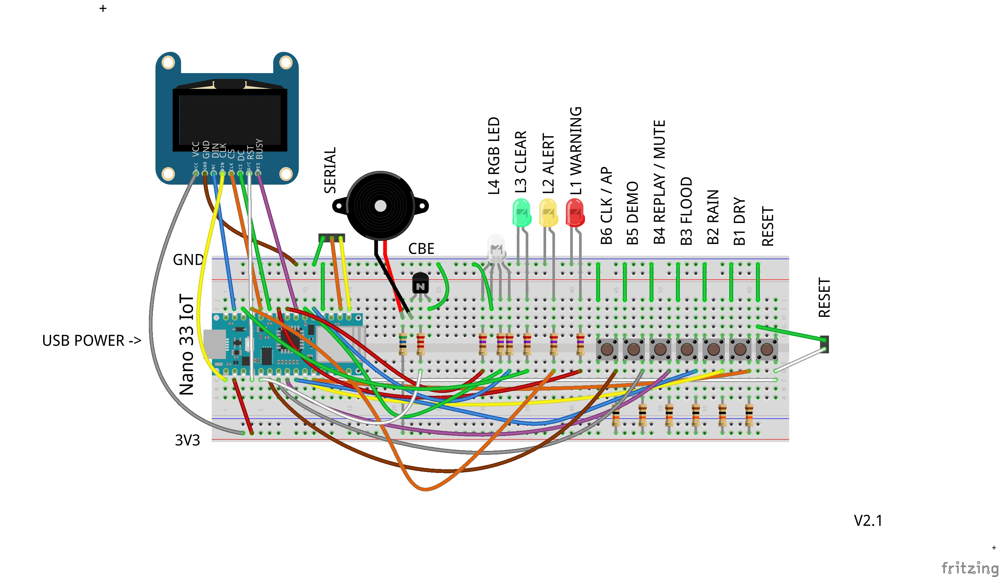

# Flood Falcon & Flood Magnet
Arduino powered flood warning devices

Flood Magnet
.

## Introduction
The Environment Agency flood-monitoring API provides developers with access to near real time information covering:

- Flood warnings and flood alerts
- Flood areas which to which warnings or alerts apply
- Measurements of water levels and flows
- Information on the monitoring stations providing those measurements

Water levels and flows are regularly monitored, usually every 15 minutes. However, data is transferred back to the Environment Agency at various frequencies, usually depending on the site and level of flood risk. Transfer of data is typically once or twice per day, but usually increases during times of heightened flood risk.

These APIs are provided as open data under the Open Government Licence with no requirement for registration. If you make use of this data please acknowledge this with the following attribution statement:

"this uses Environment Agency flood and river level data from the real-time data API (Beta)"

## Getting your flood warning area
This is the easiest way to find out your flood area but there needs to be an alert or warning at the time:

You can get all the flood warnings in the UK in you browser by visiting the following URL:
[Flood alerts and warnings](https://check-for-flooding.service.gov.uk/alerts-and-warnings)

Click on the warning you are interested in for example Keswick Campsite:
[https://check-for-flooding.service.gov.uk/target-area/011FWFNC6KC](https://check-for-flooding.service.gov.uk/target-area/065WAF441)

The last part of the URL above is the flood warning area code in this example it is 011FWFNC6KC

## Testing
You can test the API for your flood area by making a request in your browser to the following URI:
http://environment.data.gov.uk/flood-monitoring/id/floods/{your-flood-area-code}

So in the example above for the Keswick Campsite use this URI:
[https://check-for-flooding.service.gov.uk/target-area/011FWFNC6KC](https://check-for-flooding.service.gov.uk/target-area/011FWFNC6KC)

This will return a JSON object with all the flood information for that area.

## API Documentation:
[Flood API](http://environment.data.gov.uk/flood-monitoring/doc/reference#flood-warnings)

## Falcon display
The Falcon / Magnet polls the API at the frequency you set and it receives the API response and displays the following data:

An icon representing the flood warning which may be at one of four possible severity levels - derived from the severityLevel:

Level	Name				    Meaning
1. Severe Flood Warning		    Severe Flooding, Danger to Life.
2. Flood Warning			    Flooding is Expected, Immediate Action Required.
3. Flood Alert                  Flooding is Possible, Be Prepared.
4. Warning no Longer in Force   The warning is no longer in force

The severity level description - derived from severity

The update date / time - derived from timeRaised (The date and time the warning was last reviewed. Usually (but not always) this leads to a change in the message or severity)

## Configuration
User config is in "falcon_config.h" or "magnet_config.h" Add your WiFi details and Flood Area there.

Audio clips are in ./audio - connect your sound board to your PC and copy the clips to the mounted drive.

## Demo Mode
Hold down the Demo button and press the Reset button to enter Demo Mode. Press Reset again to exit back to Standard Mode.

